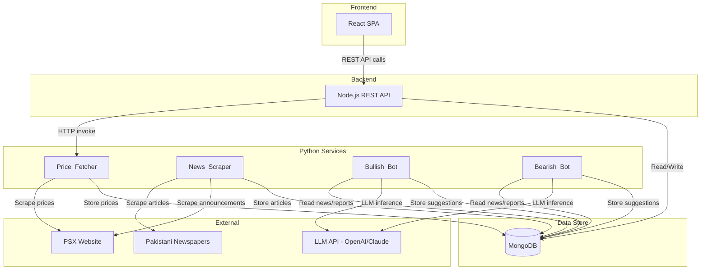

# Design Document: PSX Portfolio Platform

## Overview

The PSX Portfolio Platform is a multi-service application enabling Pakistani stock investors to manage portfolios, track live prices, browse financial news, and receive AI-driven investment suggestions. The system is composed of three layers:

1. **React Frontend** — Single-page application providing portfolio views, trade recording, news browsing, and suggestion display.
2. **Node.js Backend** — REST API server handling authentication, portfolio CRUD, trade operations, and orchestrating Python service calls.
3. **Python Services** — Three services: Price_Fetcher (on-demand scraping), News_Scraper (daily cron), and AI analysis bots (Bullish_Bot, Bearish_Bot).

Key design drivers:
- **On-demand price fetching** rather than continuous polling (user-triggered via button click)
- **Dual-AI adversarial recommendation system** where a bullish and bearish bot compete, with the higher-conviction bot driving the final suggestion
- **6-month rolling data window** for news and reports
- **30-second hard timeout** on price fetch operations

## Architecture

### High-Level Architecture Diagram



### Communication Patterns

| Interaction | Pattern | Protocol |
|---|---|---|
| Frontend ↔ Backend | Request/Response | HTTP REST (JSON) |
| Backend → Price_Fetcher | Synchronous invoke | HTTP (internal) |
| Cron → News_Scraper | Scheduled trigger | System cron / task scheduler |
| Cron → AI Bots | Scheduled trigger (after News_Scraper) | System cron / task scheduler |
| Python Services → Database | Direct connection | MongoDB driver |
| Python Services → External sites | Web scraping | HTTP + BeautifulSoup |
| AI Bots → LLM | API call | HTTPS REST |

### Design Decisions

1. **MongoDB over PostgreSQL**: Document-oriented storage fits the semi-structured nature of scraped articles and flexible portfolio data. Embedded documents reduce joins for holdings within portfolios.
2. **Synchronous Price Fetch**: The user clicks "Refresh Prices" and waits (up to 30s). This is simpler than async queuing for a single-user or small-user-count system. The backend proxies the Python service call.
3. **Separate Python services**: Price_Fetcher runs on-demand (invoked by Node.js API). News_Scraper and AI bots run on cron schedules. This separation allows independent scaling and failure isolation.
4. **Adversarial AI pattern**: Two bots with opposing biases reduce individual model bias. The conviction score mechanism provides a transparent resolution when they disagree.

## Components and Interfaces

### Frontend (React SPA)

**Pages/Views:**
- `PortfolioPage` — Displays holdings table, total investment, P/L summary
- `TradePage` — Form for recording buy/sell trades
- `PricesRefresh` — Button component with loading state
- `NewsPage` — Paginated article list with filters
- `ArticleDetail` — Full article view
- `SuggestionsPage` — Daily AI recommendations with dual-bot analysis

**Key Components:**
- `HoldingsTable` — Renders sorted holdings with calculated fields
- `TradeForm` — Validates and submits trade data
- `NewsFilter` — Filter panel (symbol, source, date range)
- `SuggestionCard` — Displays bot analyses and final recommendation

### Backend (Node.js REST API)

**API Endpoints:**

| Method | Path | Description |
|---|---|---|
| GET | `/api/portfolio` | Get portfolio overview with all holdings |
| POST | `/api/trades` | Record a new trade (buy/sell) |
| GET | `/api/trades` | Get trade history |
| POST | `/api/prices/refresh` | Trigger price fetch for all portfolio stocks |
| GET | `/api/news` | Get paginated articles with filters |
| GET | `/api/news/:id` | Get single article detail |
| GET | `/api/suggestions` | Get latest daily suggestions |
| GET | `/api/suggestions/history` | Get historical suggestions |

**Services (internal):**
- `PortfolioService` — CRUD operations, average price calculations
- `TradeService` — Trade validation, holding updates
- `PriceFetchService` — Orchestrates call to Python Price_Fetcher, handles timeout
- `NewsService` — Query articles with filters, pagination
- `SuggestionService` — Query and format AI suggestions

### Python Services

**Price_Fetcher:**
- Endpoint: `POST /fetch-prices` (accepts list of ticker symbols)
- Scrapes PSX website for current prices
- Returns: `{ prices: [{ symbol, price, timestamp }], errors: [{ symbol, reason }] }`

**News_Scraper (Cron):**
- Scrapes configured newspaper sources
- Scrapes PSX announcements
- Extracts article metadata and text
- Tags articles with matched stock symbols
- Deduplicates by (source, title, publication_date)
- Cleans up articles older than 6 months

**AI Bots (Cron, runs after News_Scraper):**
- `Bullish_Bot`: Analyzes with optimistic bias
- `Bearish_Bot`: Analyzes with pessimistic bias
- Both produce per-stock recommendations with conviction scores
- Platform resolves final suggestion by highest conviction score

## Data Models

### Holdings Collection

```json
{
  "_id": "ObjectId",
  "user_id": "string",
  "symbol": "string",
  "quantity": "number (integer, >= 1)",
  "average_buying_price": "number (decimal, >= 0.01)",
  "created_at": "datetime",
  "updated_at": "datetime"
}
```

### Trades Collection

```json
{
  "_id": "ObjectId",
  "user_id": "string",
  "symbol": "string",
  "type": "string (buy | sell)",
  "quantity": "number (integer, 1 to 1,000,000)",
  "price_per_share": "number (decimal, 0.01 to 99,999.99)",
  "total_amount": "number (decimal, quantity × price_per_share)",
  "timestamp": "datetime"
}
```

### Prices Collection

```json
{
  "_id": "ObjectId",
  "symbol": "string",
  "price": "number (decimal)",
  "fetched_at": "datetime"
}
```
Index: `{ symbol: 1, fetched_at: -1 }` for quick latest-price lookups.

### Articles Collection

```json
{
  "_id": "ObjectId",
  "title": "string (max 500 chars)",
  "source": "string",
  "publication_date": "datetime",
  "full_text": "string (max 50,000 chars)",
  "summary": "string (max 300 chars)",
  "stock_symbols": ["string"],
  "scraped_at": "datetime"
}
```
Index: `{ source: 1, title: 1, publication_date: 1 }` (unique, for deduplication).
Index: `{ stock_symbols: 1, publication_date: -1 }` for filtered queries.
TTL Index: `{ scraped_at: 1 }` with `expireAfterSeconds: 15552000` (180 days) for automatic 6-month cleanup.

### Suggestions Collection

```json
{
  "_id": "ObjectId",
  "user_id": "string",
  "date": "date",
  "stock_symbol": "string",
  "category": "string (current_holding | new_recommendation)",
  "bullish_analysis": {
    "action": "string (buy | hold | sell)",
    "conviction_score": "number (1-10)",
    "reasoning": "string (max 500 chars)"
  },
  "bearish_analysis": {
    "action": "string (buy | hold | sell)",
    "conviction_score": "number (1-10)",
    "reasoning": "string (max 500 chars)"
  },
  "final_suggestion": {
    "action": "string (buy | hold | sell)",
    "source_bot": "string (bullish | bearish | tie)",
    "conviction_score": "number (1-10)"
  },
  "created_at": "datetime"
}
```
Index: `{ user_id: 1, date: -1 }` for fetching latest suggestions.

## Correctness Properties

*A property is a characteristic or behavior that should hold true across all valid executions of a system — essentially, a formal statement about what the system should do. Properties serve as the bridge between human-readable specifications and machine-verifiable correctness guarantees.*

### Property 1: Total investment equals sum of holding costs

*For any* portfolio with one or more holdings, the total investment amount SHALL equal the sum of (quantity × average_buying_price) for all holdings in the portfolio.

**Validates: Requirements 1.1**

### Property 2: Holdings are sorted alphabetically by ticker symbol

*For any* portfolio with multiple holdings, the displayed holdings list SHALL be sorted in ascending alphabetical order by ticker symbol.

**Validates: Requirements 1.2**

### Property 3: Profit/loss calculations are correct

*For any* holding with a known current price and a positive average buying price, the profit/loss amount SHALL equal (current_price - average_buying_price) × quantity, and the profit/loss percentage SHALL equal ((current_price - average_buying_price) / average_buying_price) × 100.

**Validates: Requirements 1.3, 1.4**

### Property 4: Monetary and percentage values are rounded to 2 decimal places

*For any* monetary value or percentage value displayed by the platform, the formatted output SHALL have exactly 2 decimal places.

**Validates: Requirements 1.8**

### Property 5: Buy trade correctly updates holding via weighted average

*For any* existing holding (or new stock with zero prior holding) and any valid buy trade, the resulting holding quantity SHALL equal old_quantity + trade_quantity, and the resulting average buying price SHALL equal ((old_quantity × old_average_price) + (trade_quantity × trade_price)) / (old_quantity + trade_quantity).

**Validates: Requirements 3.1, 3.4**

### Property 6: Sell trade decreases quantity while preserving average price

*For any* holding and any valid sell trade (where trade_quantity ≤ holding_quantity), the resulting holding quantity SHALL equal old_quantity - trade_quantity, and the average buying price SHALL remain unchanged.

**Validates: Requirements 3.2**

### Property 7: Invalid trade inputs are rejected

*For any* trade submission where the quantity is less than 1 or greater than 1,000,000, or the price per share is less than 0.01 or greater than 99,999.99, or the ticker symbol is not in the valid PSX-listed stocks set, the trade SHALL be rejected and no holding shall be modified.

**Validates: Requirements 3.7, 3.8**

### Property 8: Article symbol tagging identifies all matching portfolio symbols

*For any* article text and any set of PSX ticker symbols from a user's holdings, the tagging function SHALL identify and tag every symbol from the set that appears in the article title or body, and SHALL NOT tag symbols that do not appear in the text.

**Validates: Requirements 4.4**

### Property 9: Stored article fields respect maximum length constraints

*For any* scraped article, the stored title SHALL be at most 500 characters, the stored full text SHALL be at most 50,000 characters, and the stored summary SHALL be at most 300 characters.

**Validates: Requirements 4.7**

### Property 10: Article storage is idempotent for duplicates

*For any* article with a given (source, title, publication_date) tuple, storing it multiple times SHALL result in exactly one record in the database.

**Validates: Requirements 4.9**

### Property 11: Final suggestion selects the bot with higher conviction score

*For any* pair of bullish and bearish analyses for a stock, the final suggestion SHALL be the recommendation from the bot with the higher conviction score. If both conviction scores are equal and the stock is a current holding, the final suggestion SHALL be "hold". If both scores are equal and the stock is a new recommendation, the stock SHALL be excluded.

**Validates: Requirements 5.3**

### Property 12: All current holdings receive suggestions

*For any* user portfolio with one or more holdings, the daily suggestion output SHALL contain a recommendation for every stock currently held in the portfolio.

**Validates: Requirements 5.6**

### Property 13: New stock recommendations are capped at 5

*For any* daily suggestion output, the number of new stock recommendations (stocks not currently in the user's portfolio) SHALL be at most 5.

**Validates: Requirements 5.7**

### Property 14: News filtering returns only articles matching all active filters

*For any* set of articles and any combination of filters (stock symbol, source, date range), every article in the filtered result set SHALL match ALL active filter conditions, results SHALL be sorted by publication date newest-first, and each page SHALL contain at most 20 articles.

**Validates: Requirements 6.1, 6.2, 6.4**

## Error Handling

### Frontend Error Handling

| Scenario | Behavior |
|---|---|
| API request fails (network error) | Display toast notification with retry option. Do not clear existing data. |
| Price fetch timeout (30s) | Show timeout error message, re-enable refresh button, retain previous prices. |
| Partial price fetch failure | Show success for fetched prices, display per-symbol error list. |
| Trade validation failure | Display inline error messages on the form field that failed. |
| Empty portfolio state | Show empty state with call-to-action to record first trade. |
| No articles match filters | Show "no results" message with clear-filters button. |
| AI suggestions unavailable | Show notification, display previous day's suggestions as fallback. |

### Backend Error Handling

| Scenario | Behavior |
|---|---|
| Python Price_Fetcher unreachable | Return 503 with message "Price service unavailable". Preserve existing price data. |
| Price_Fetcher partial failure | Return 207 (Multi-Status) with successful prices and per-symbol errors. |
| Trade validation errors | Return 400 with structured error object identifying invalid fields and constraints. |
| Invalid ticker symbol | Return 400 with message "Ticker symbol not recognized as PSX-listed stock". |
| Database connection failure | Return 500 with generic error. Log full details server-side. |
| News_Scraper source failure | Log failure with source name and error. Continue with remaining sources. Retry failed source 3 times. |
| AI bot failure (one bot) | Store available bot's analysis. Mark final suggestion as incomplete. |
| AI bot failure (both bots) | Log failure. Retain previous day's suggestions. Send admin alert. |
| News_Scraper/AI bot unreachable | Log failure with timestamp. Retry once after 60 seconds. Mark cycle failed if retry fails. |

### Data Integrity Safeguards

- **Optimistic concurrency** on holdings: Use document version field to prevent lost updates from concurrent trades.
- **Atomic trade operations**: Use MongoDB transactions to update holdings and insert trade record atomically.
- **Price data immutability**: Price records are append-only (never updated). Latest price is always the most recent by `fetched_at`.
- **Article deduplication**: Unique compound index on (source, title, publication_date) prevents duplicates at the database level.

## Testing Strategy

### Unit Tests (Example-Based)

**Node.js Backend:**
- Trade validation: specific valid/invalid trade examples
- API response formatting
- Error response structure

**Python Services:**
- Price scraping parser with mock HTML responses
- News article extraction with sample pages
- Symbol matching edge cases (partial matches, case sensitivity)

**React Frontend:**
- Component rendering with various data states
- Empty states and error states
- Form validation feedback

### Property-Based Tests

**Library:** [fast-check](https://github.com/dubzzz/fast-check) for Node.js/TypeScript, [Hypothesis](https://hypothesis.readthedocs.io/) for Python.

**Configuration:** Minimum 100 iterations per property test.

**Tag format:** `Feature: psx-portfolio-platform, Property {number}: {property_text}`

Properties to implement:
1. Portfolio total investment calculation (Property 1)
2. Holdings alphabetical sort (Property 2)
3. P/L and P/L% calculations (Property 3)
4. Monetary/percentage rounding (Property 4)
5. Buy trade weighted average formula (Property 5)
6. Sell trade quantity decrease with avg price preservation (Property 6)
7. Invalid trade input rejection (Property 7)
8. Article symbol tagging correctness (Property 8)
9. Article field length constraints (Property 9)
10. Article deduplication idempotence (Property 10)
11. Conviction score resolution logic (Property 11)
12. Holdings coverage completeness (Property 12)
13. New recommendation cap at 5 (Property 13)
14. News filtering AND-logic with sort and pagination (Property 14)

### Integration Tests

- End-to-end price fetch flow (Node.js → Python → PSX mock → DB)
- Trade recording with database persistence
- News scraper with mocked external sources
- AI bot pipeline with mocked LLM responses
- Cross-service database access (Node.js and Python reading same collections)
- Timeout and retry behavior

### Smoke Tests

- Cron job schedule configuration
- Database connectivity from both services
- React app builds and serves
- Python services start and respond to health checks

